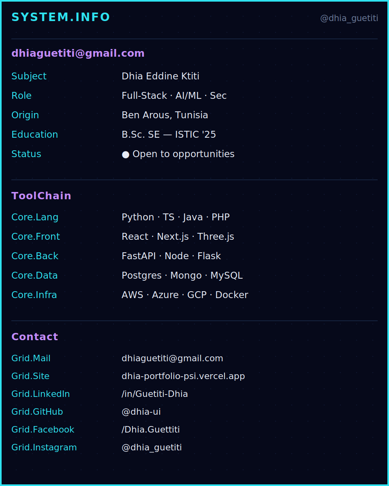

  

  <h3>Building secure, production-ready products at the intersection of AI, web, and cloud.</h3>

  

    
    
    
  

  

    
    
  

---

## Introduction

I design and deliver full-stack platforms with practical AI integrations, strong backend architecture, and a security-first mindset. My focus is clean execution: scalable APIs, maintainable frontends, and measurable business value.

### Value proposition

- Ship reliable web + AI features with production-quality engineering standards.
- Turn complex workflows into simple, usable interfaces.
- Improve trust and resilience through applied security practices.

---

## Visual identity

  <picture>
    <source srcset="./visual-map.gif" type="image/gif" />
    
  </picture>

---

## Skills & tooling

| Area | Stack |
|---|---|
| Languages |    |
| Frontend |    |
| Backend |   |
| AI / ML |   |
| Cloud & Security |     |

---

## Selected projects

| Project | Focus | Link |
|---|---|---|
| Sotunol API | FastAPI microservices and enterprise backend architecture | [dhia-ui/Sotunol-API-](https://github.com/dhia-ui/Sotunol-API-) |
| Portfolio | Interactive personal portfolio experience | [dhia-ui/dhia-portfolio-](https://github.com/dhia-ui/dhia-portfolio-) |
| AI model work | Model training and practical ML delivery | [dhia-ui/Train-Model](https://github.com/dhia-ui/Train-Model) |
| Community platform | Full-stack web product for student/community use | [dhia-ui/radio-istic](https://github.com/dhia-ui/radio-istic) |

---

## Activity & stats

  
  
   
  

---

## Highlights

- 🛡️ **Certified LLM Security Professional (CLLMSP)**
- 🚩 **SparkCTF:** 10th place nationally
- 💘 **ValentineCTF:** 13th place nationally
- ☁️ **Aviatrix Multicloud Associate (ACE)**

---

## Contact

  <a href="https://dhia-portfolio-psi.vercel.app">Portfolio</a> •
  <a href="mailto:dhiaguetiti@gmail.com">Email</a> •
  <a href="https://www.linkedin.com/in/guetiti-dhia/">LinkedIn</a> •
  <a href="https://instagram.com/dhia_guetiti">Instagram</a>

    
  <em>"Security is not a product, but a process." — Bruce Schneier</em>

